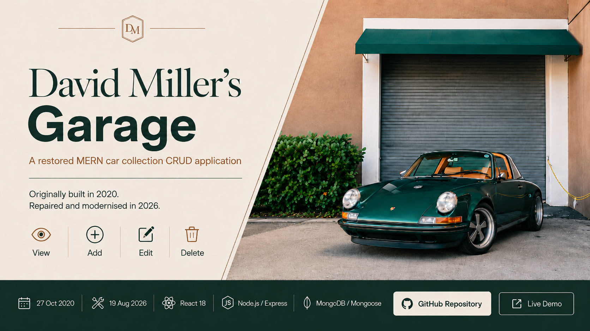

# David Miller’s Garage

[](https://david-millers-garage.vercel.app/)

A restored MERN car collection CRUD application, originally built in 2020 as part of the Hyperion Development Bootcamp.

## Live Demo

**Online demo:** https://david-millers-garage.vercel.app

The hosted version is a safe demonstration environment. Demo data is disposable and is not intended as permanent storage.

## Features

- View the current car collection
- Add a car
- Edit car details
- Delete a car
- Required-field validation
- Loading, empty and error states
- Responsive interface
- Keyboard-friendly controls and improved form labelling

Each car stores:

- Owner
- Make
- Model
- Colour
- Registration number

## Technology

### Frontend

- React 18
- React Router
- Axios
- Create React App

### Backend

- Node.js
- Express
- MongoDB / Mongoose
- CORS
- Morgan
- dotenv

### Quality and delivery

- API CRUD smoke test
- React test
- Production build verification
- GitHub Actions CI
- Safe in-memory demo mode when MongoDB credentials are not supplied

## Project Restoration

This repository began as an early full-stack MERN project in 2020. The restoration focused on fixing the original application rather than replacing it with an unrelated rewrite.

The completed work includes:

- repaired add, edit and delete request handling;
- removed hard-coded frontend API addresses;
- added safe environment configuration;
- added an in-memory demo data mode;
- improved responsive behaviour;
- improved accessibility and action semantics;
- added visible loading and error handling;
- added API CRUD testing;
- added automated CI;
- verified the production React build;
- refreshed the project identity as **David Miller’s Garage**;
- removed obsolete generated build artefacts and unused legacy assets;
- flattened the old nested project folder into a clean repository structure.

## Repository History

The completed application is maintained on `main`.

The original pre-restoration state is preserved on:

`archive/pre-modernisation`

This keeps the historical version available without making it the public default version of the project.

## Project Structure

```text
.
├── client/
│   ├── public/
│   └── src/
├── models/
├── routes/
├── tests/
├── server.js
├── package.json
└── README.md
```

## Local Setup

### Requirements

- Node.js 20 or newer
- npm

### Install dependencies

From the repository root:

```bash
npm install
npm install --prefix client
```

### Run the API

```bash
npm start
```

The API runs at:

```text
http://localhost:4000
```

If no MongoDB connection is configured, the API automatically uses the safe in-memory demo mode.

### Run the React client

```bash
npm start --prefix client
```

The React development server uses the local API through its proxy configuration.

## Optional MongoDB Mode

Copy `.env.example` to `.env` and configure the MongoDB connection value when persistent storage is required.

Do not commit `.env` or database credentials to Git.

## API Routes

```text
GET     /health
GET     /cars/
POST    /cars/add
GET     /cars/:id
POST    /cars/update/:id
DELETE  /cars/:id
```

## Testing

### API CRUD test

```bash
npm test
```

The smoke test verifies:

```text
health → list → create → read → update → delete
```

### React test

```bash
npm test --prefix client
```

### Production build

```bash
npm run build --prefix client
```

GitHub Actions runs the API test, React test and production build automatically for `main` and pull requests targeting `main`.

## Limitations

- The hosted demo uses disposable data.
- Authentication is outside the scope of the original project.
- The application intentionally remains a focused CRUD project rather than being expanded into a larger product.

## Original Context

Created as part of the Hyperion Development Bootcamp and retained as a record of early full-stack MERN development work and later restoration work.

## Author

**David Miller**

## License

MIT License
